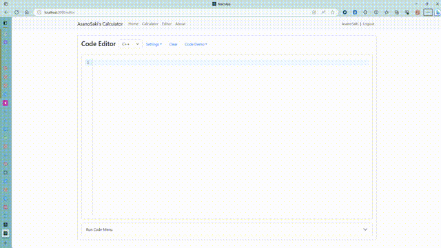

# Calculator React

## 1. 项目介绍

【V1.0 版本介绍】：

本项目为基于 Django 与 React 开发的在线编译器与计算器，采用前后端分离的架构模式，可以很轻易地部署至云服务器上或用 Docker 容器进行迁移部署。

本项目前端界面基于 React + Bootstrap 开发，计算器页面的各组件间的状态由 Redux 维护，通过 `npm` 部署并一键打包静态文件至后端，后端采用 Django 框架实现注册/登录/登出等 API 接口，同时使用 Django 渲染前端界面，解决不同端口的跨域问题。

Django 超级管理员账户：

 - 用户名：`admin`
 - 密码：`admin`

【V2.0 更新】：

添加了网页端在线编译器，前端由 React 结合 CodeMirror 搭建，后端运用 Python Subprocess 子进程相关技术，实现在线编辑与运行代码等功能（V2.0 版本仅支持 C++、Python）。

在线编辑器 Demo：



 - V2.1 更新：实现 C++、Python 的基础代码补全功能（关键字补全）。
 - V2.2 更新：导航栏添加实时显示当前时间功能。

【V3.0 更新】：

将定时器由 `setInterval` 换为 `setPromiseInterval`，修复 `setInterval` 导致长时间运行网站后产生的严重卡顿问题。

在 About 页面中添加了由 SMTP 协议支持的向开发者匿名发送邮件的功能（需要在 `settings.py` 文件中配置你的邮箱信息），给予广大用户反馈意见的途径，此外还添加了修改用户个人信息的页面。

## 2. 环境要求

### 2.1 Python env

V1.0 版本环境：

 - Django 4.2.5：`pip install Django`
 - django-cors-headers 4.2.0：`pip install django-cors-headers`

V2.0 更新：

 - psutil 5.9.5：`pip install psutil`

### 2.2 Node modules

V1.0 版本环境：

 - 默认环境（创建 React 项目时产生）：`create-react-app calculator_react`
 - bootstrap 5.3.1：`npm i bootstrap`
 - jquery 3.7.1：`npm i jquery`
 - react-router-dom 18.2.0：`npm i react-router-dom`
 - redux 4.2.1 & react-redux 8.1.2 & @reduxjs/toolkit 1.9.5：`npm i redux react-redux @reduxjs/toolkit`

V2.0 更新：

 - @uiw/react-codemirror 4.21.13：`npm install @uiw/react-codemirror --save`
 - @uiw/codemirror-extensions-langs 4.21.13：`npm install @uiw/codemirror-extensions-langs`
 - @uiw/codemirror-theme-github 4.21.13：`npm install @uiw/codemirror-theme-github`
 - @uiw/codemirror-theme-okaidia 4.21.13：`npm install @uiw/codemirror-theme-okaidia`
 - @uiw/codemirror-theme-vscode 4.21.13：`npm install @uiw/codemirror-theme-vscode`

V2.1 更新：

 - @codemirror/autocomplete 6.9.1：`npm install @codemirror/autocomplete`

V2.2 更新：

 - moment 2.29.4：`npm install moment`

V3.0 更新：

 - set-promise-interval 1.0.8：`npm install set-promise-interval`

一键安装 `package.json` 里的所有依赖文件：

```shell
npm install
```

## 3. 启动相关服务

 - 创建 Python 虚拟环境：`python -m venv venv`
 - 启动 Python 虚拟环境：`.\venv\Scripts\Activate.ps1`
 - 启动 React 前端项目：`npm start`
 - 打包 React 前端项目：`npm run build`（React 项目打包后将 `index.html`、`main.xxx.js`、`main.xxx.css` 三个文件放到 Django 项目对应的目录下即可部署至 Django 服务端上）
 - 启动 Django 后端项目：`python manage.py runserver localhost:8000`

## 4. 部署至云服务器

部署至云服务器上需要将前端中的 HTTP 请求 API 改为云服务器的地址，目前有向后端发送请求的文件为：

 - `src/components/app.jsx`
 - `src/components/navbar.jsx`
 - `src/components/content/login.jsx`
 - `src/components/content/register.jsx`
 - `src/components/content/about.jsx`
 - `src/components/content/profile.jsx`
 - `src/components/content/editor/editorFooter.jsx`
